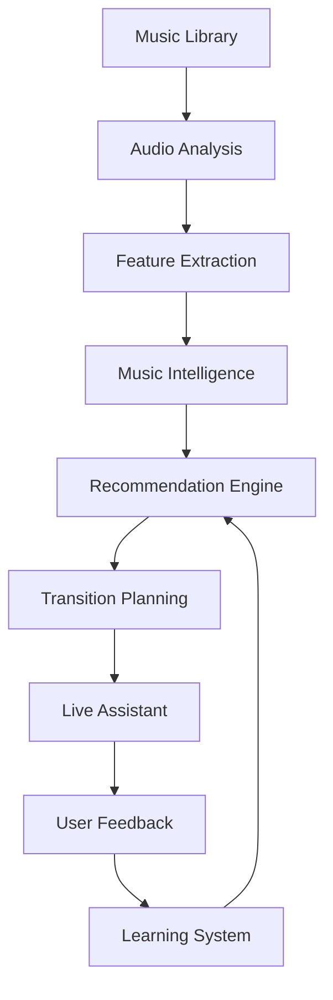
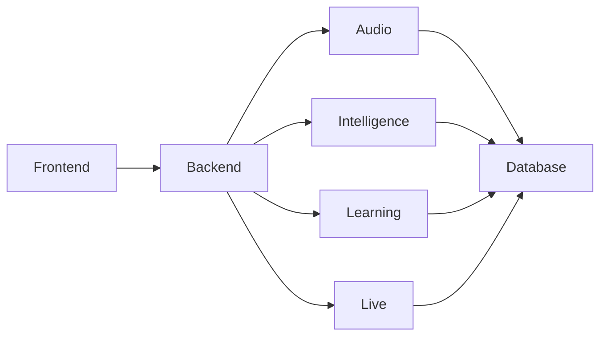
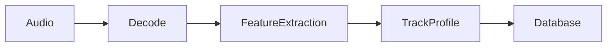
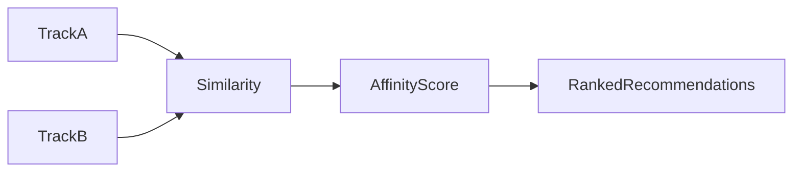
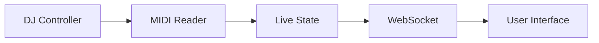
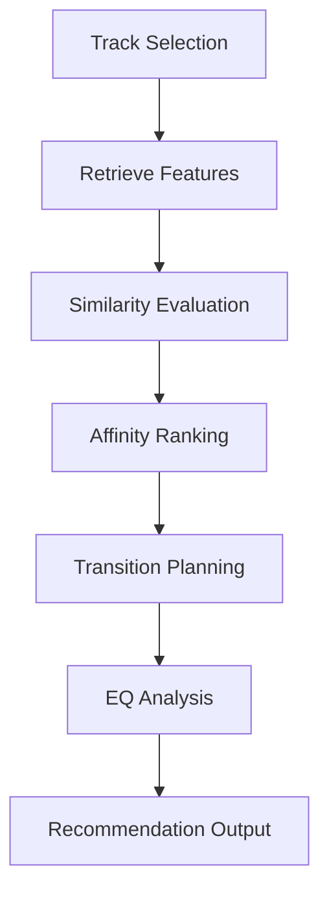
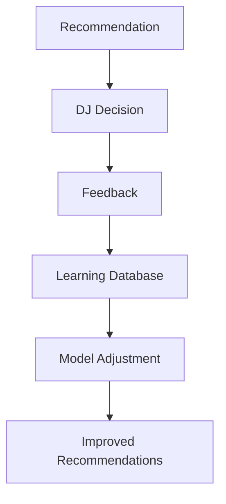

# ARCHITECTURE — DJ Copilot

## Overview

DJ Copilot is designed as a modular music intelligence platform composed of specialized components responsible for different stages of the music analysis and recommendation pipeline.

Instead of implementing a monolithic application where every feature depends on every other feature, the platform separates responsibilities into independent modules that communicate through clearly defined interfaces.

This approach allows individual components to evolve independently while maintaining a coherent system architecture.

---

# Architectural Goals

The architecture is guided by several engineering principles.

## Separation of Responsibilities

Each module performs a single well-defined task.

Examples include:

- Audio analysis
- Feature extraction
- Recommendation
- Transition planning
- Learning
- Live assistance

No module attempts to solve multiple unrelated problems.

---

## Modular Intelligence

The platform distributes intelligence across specialized components.

Instead of one large recommendation algorithm, DJ Copilot combines multiple systems responsible for different aspects of musical understanding.

Each subsystem contributes part of the final recommendation.

---

## Real-Time Performance

Live recommendations are only valuable if they can be produced with very low latency.

For this reason:

- expensive computations are isolated
- indexing is precomputed
- recommendations reuse analyzed data
- live communication uses WebSockets

Real-time performance is considered a primary architectural requirement.

---

## Human-Centered Design

The platform never executes musical decisions autonomously.

Every recommendation is presented as assistance.

The final decision always belongs to the DJ.

---

# High-Level Architecture

The platform follows a continuous intelligence cycle where analyzed music becomes structured knowledge, recommendations are generated, user feedback is collected, and future recommendations improve over time.

---

# System Layers

DJ Copilot can be understood as five logical layers.
┌──────────────────────────────────────────┐
│ User Interface                           │
├──────────────────────────────────────────┤
│ Application Services                     │
├──────────────────────────────────────────┤
│ Music Intelligence                       │
├──────────────────────────────────────────┤
│ Audio Analysis                           │
├──────────────────────────────────────────┤
│ Data Storage                             │
└──────────────────────────────────────────┘

Each layer communicates only with adjacent layers.

This separation simplifies maintenance and future development.

---

# Layer Responsibilities

## User Interface

Responsible for interaction with the user.

Examples include:

- Library management
- Track visualization
- Transition guidance
- Live recommendations
- Performance monitoring

The interface contains no recommendation logic.

Its responsibility is presentation.

---

## Application Layer

Coordinates communication between the interface and internal services.

Responsibilities include:

- API endpoints
- request validation
- orchestration
- session management
- WebSocket communication

Business logic remains outside this layer.

---

## Music Intelligence Layer

This layer represents the core intelligence of the platform.

Responsibilities include:

- affinity computation
- recommendation generation
- transition planning
- EQ suggestions
- compatibility scoring

This layer transforms analyzed music into actionable recommendations.

---

## Audio Analysis Layer

Responsible for understanding raw audio.

Current analysis includes:

- tempo estimation
- harmonic key detection
- spectral analysis
- groove extraction
- energy estimation
- drop detection
- vocal estimation

This layer creates the musical representation used by every higher-level component.

---

## Data Layer

Stores all persistent information.

Examples:

- analyzed tracks
- affinity links
- user corrections
- live state
- imported libraries

Persistent storage allows recommendations to improve without repeating expensive computations.

---

# Component Overview

Each component has a clearly defined responsibility and communicates through the backend services.

This modular organization reduces coupling between subsystems.

---

# Audio Analysis Pipeline

The analysis pipeline transforms raw audio into structured musical information.

Each imported song passes through this pipeline only once unless reanalysis is requested.

The resulting information becomes available to every recommendation algorithm.

---

# Internal Components

The intelligence of DJ Copilot emerges from the interaction of several independent modules.

Each module owns a specific responsibility and communicates through well-defined interfaces.

This separation allows individual systems to evolve without affecting the entire platform.

---

# Audio Analysis Module

The Audio Analysis module is responsible for transforming raw audio into structured musical information.

Responsibilities include:

- Audio decoding
- Tempo estimation
- Harmonic key detection
- Spectral analysis
- Energy extraction
- Groove estimation
- Frequency analysis
- Vocal estimation
- Musical feature extraction

Output:
Raw Audio
↓
Track Intelligence Profile

Every imported track is converted into a structured representation that becomes the foundation for all higher-level reasoning.

---

# Recommendation Engine

The Recommendation Engine is responsible for discovering compatible tracks.

Rather than relying on a single similarity metric, recommendations combine multiple musical dimensions.

Current factors include:

- Harmonic compatibility
- Tempo similarity
- Spectral similarity
- Groove similarity
- Energy compatibility

The engine evaluates these dimensions simultaneously to produce ranked recommendations.

---

# Transition Assistant

The Transition Assistant transforms recommendations into actionable guidance.

Instead of simply recommending a compatible track, the system evaluates how that transition should be performed.

Possible outputs include:

- Recommended transition type
- Entry timing
- Transition duration
- Harmonic compatibility
- Equalization suggestions
- Confidence estimation

The assistant supports the DJ without enforcing any decision.

---

# Equalization Advisor

Certain transitions introduce frequency conflicts that may reduce mix quality.

The Equalization Advisor analyzes overlapping frequency regions and suggests corrective actions.

Typical recommendations include:

- Reduce bass frequencies
- Delay vocal overlap
- Lower mid frequencies
- Smooth high-frequency transitions

This module complements the Transition Assistant by focusing specifically on spectral compatibility.

---

# Live Assistant

The Live Assistant connects DJ Copilot to external hardware during performances.

Current responsibilities include:

- MIDI communication
- Controller monitoring
- Crossfader tracking
- WebSocket synchronization
- Live recommendation updates

The module continuously maintains the current performance state.

This architecture enables recommendations to adapt dynamically during live sessions.

---

# Learning System

DJ Copilot includes an adaptive learning mechanism based on human feedback.

Whenever users correct recommendations, the system records those decisions for future analysis.

Responsibilities include:

- Feedback logging
- Recommendation refinement
- Preference adaptation
- Continuous improvement

Learning is intentionally conservative.

The platform assists the DJ rather than attempting to replace human judgment.

---

# Library Management

Music libraries represent the entry point of the platform.

DJ Copilot currently supports importing collections from multiple formats.

Supported sources include:

- Rekordbox XML
- Rekordbox SQLite
- Playlist files
- Local music folders

Once imported, tracks enter the analysis pipeline automatically.

---

# Data Model

Persistent information is organized into logical entities.
Track
↓
Analysis
↓
Feature Vector
↓
Affinity Links
↓
Recommendations
↓
User Feedback

This model separates raw information from generated knowledge.

As a result, recommendations can be regenerated without repeating expensive audio analysis.

---

# Recommendation Flow

The recommendation pipeline follows a deterministic sequence of operations.

Every recommendation represents the result of multiple specialized analyses rather than a single algorithm.

---

# Learning Cycle

User feedback continuously improves recommendation quality.

This creates an iterative improvement cycle while preserving user control.

---

# Scalability

The platform is designed to evolve beyond its current implementation.

Future improvements may include:

- larger music libraries
- distributed recommendation services
- cloud synchronization
- richer music understanding
- semantic analysis
- personalized recommendation models
- improved transition planning
- expanded real-time assistance

The modular architecture allows these capabilities to be introduced without redesigning the entire platform.

---

# Architectural Principles

The long-term evolution of DJ Copilot follows several core principles.

## Single Responsibility

Every subsystem owns a clearly defined task.

---

## Modularity

Components evolve independently whenever possible.

---

## Extensibility

New recommendation algorithms should integrate without modifying existing modules.

---

## Low Latency

Real-time assistance remains a primary architectural objective.

---

## Human-Centered AI

Artificial intelligence supports creative decisions.

It never replaces them.

---

## Progressive Evolution

The architecture is intentionally designed to support future generations of music intelligence systems while maintaining compatibility with existing workflows.

---

# Summary

DJ Copilot combines digital signal processing, recommendation systems, real-time communication, and adaptive learning into a unified architecture focused on assisting musical decision-making.

The platform is designed around modular intelligence, allowing individual components to evolve independently while contributing to a coherent system capable of understanding music, generating recommendations, and supporting live performance.
