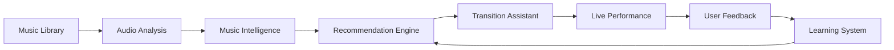
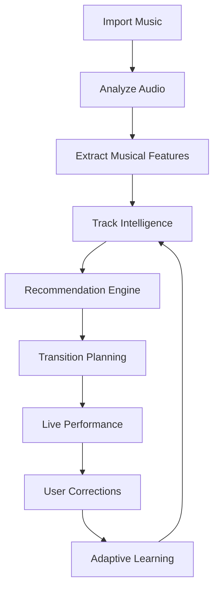
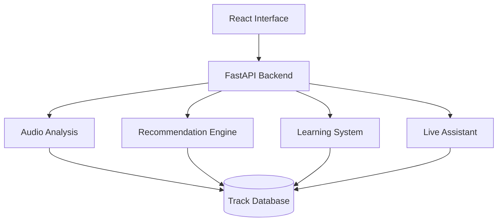

# DJ Copilot

> AI-assisted music intelligence platform for DJs.
>
> Analyze music, understand transitions, discover compatible tracks, and assist live performance through real-time audio intelligence.

---

## Overview

DJ Copilot is an experimental AI platform designed to augment—not replace—the creative workflow of DJs.

The project combines audio signal processing, music theory, recommendation systems, real-time communication, and machine learning into a single platform capable of understanding musical relationships between tracks and assisting DJs before and during live performances.

Instead of focusing only on BPM matching or harmonic compatibility, DJ Copilot explores how artificial intelligence can reason about multiple musical dimensions simultaneously to provide more meaningful recommendations.

The platform is currently focused on four core capabilities:

- Understanding music through audio analysis.
- Discovering relationships between tracks.
- Assisting transition decisions.
- Learning from DJ feedback over time.

---

# Why DJ Copilot?

Professional DJs continuously make hundreds of decisions during a performance.

Questions such as:

- What track should come next?
- How can I transition smoothly between genres?
- Which songs maintain the current energy?
- Which transition is technically safer?
- How can I recover after an unexpected change?

Most existing DJ software provides library management, BPM detection, harmonic analysis, or playlist organization.

DJ Copilot investigates a different question:

> **How can artificial intelligence assist musical decision-making while preserving the DJ's creative control?**

The objective is not automation.

The objective is intelligent assistance.

---

# Vision

DJ Copilot explores the idea of **Music Intelligence**.

Rather than treating every track as a simple audio file, the system attempts to build a structured understanding of music by combining multiple sources of information:

- Audio features
- Harmonic compatibility
- Spectral similarity
- Energy progression
- Transition behavior
- User preferences
- Performance feedback

The long-term vision is a platform capable of helping DJs prepare performances, discover music, understand libraries, and receive real-time assistance without interfering with artistic decisions.

---

# Core Capabilities

## Audio Intelligence

Each imported track is analyzed to extract meaningful musical information beyond basic metadata.

Current analysis includes:

- Tempo estimation
- Harmonic key detection
- Energy estimation
- Spectral analysis
- Groove density
- Vocal detection
- Drop identification
- Frequency distribution

Instead of storing only metadata, DJ Copilot creates an internal musical representation that becomes the foundation for all recommendation processes.

---

## Music Recommendation

Recommendations are generated through a combination of musical similarity metrics rather than a single scoring algorithm.

The current recommendation pipeline considers factors such as:

- Harmonic compatibility
- Tempo similarity
- Spectral characteristics
- Groove compatibility
- Energy progression

This allows recommendations to prioritize musical coherence instead of relying solely on BPM or key matching.

---

## Transition Assistance

DJ Copilot assists transition planning by evaluating compatibility between tracks and suggesting mixing strategies.

Recommendations may include:

- Suggested transition type
- Entry timing
- Transition duration
- Equalization guidance
- Harmonic compatibility
- Confidence estimation

The objective is to provide useful guidance while leaving the final artistic decision entirely to the performer.

---

## Live Performance Assistance

During live sessions the platform can connect to external DJ hardware through MIDI and WebSocket communication.

This enables real-time monitoring of performance state and allows the assistant to provide contextual recommendations based on the current mix.

Examples include:

- Compatible next tracks
- Transition timing
- Equalization suggestions
- Crossfader guidance
- Live state synchronization

---

## Adaptive Learning

DJ Copilot includes an initial human-in-the-loop learning mechanism.

Instead of assuming every recommendation is correct, the platform records user corrections to continuously improve future suggestions.

This creates a recommendation engine capable of adapting to different DJ styles over time.

---

# Design Philosophy

Several principles guide the development of DJ Copilot.

## AI Should Assist, Not Replace

The platform never attempts to automate creativity.

Its purpose is to provide information, suggestions, and contextual assistance while allowing the DJ to remain in full control of every decision.

---

## Music Is Multi-Dimensional

A track cannot be represented only by BPM or musical key.

Every recommendation should consider multiple musical characteristics simultaneously.

---

## Real-Time First

Recommendations become valuable only if they can be delivered fast enough to support live performance.

Low latency is therefore considered a core architectural requirement rather than an optimization.

---

## Human Feedback Matters

Every DJ develops unique preferences.

The system should continuously learn from corrections instead of assuming universal mixing rules.

---

## Modular Intelligence

Each component of the platform performs a specialized task.

Audio analysis.

Recommendation.

Transition planning.

Learning.

Live assistance.

These modules remain independent while collaborating through well-defined interfaces.

---

# High-Level Architecture



The platform follows a continuous intelligence loop.

Music is analyzed.

Relationships are discovered.

Recommendations are generated.

The DJ decides.

Feedback improves future recommendations.

---

# System Workflow



Instead of treating analysis as a one-time operation, DJ Copilot continuously improves its understanding of both the music library and the user's decision-making patterns.

---

# Core Components

DJ Copilot is organized into a collection of specialized modules responsible for different stages of the music intelligence pipeline.

Rather than concentrating all logic into a single monolithic system, the platform separates responsibilities into independent components that can evolve without affecting the rest of the architecture.

| Component | Responsibility |
|-----------|----------------|
| Audio Analysis | Extract musical information from raw audio files |
| Feature Extraction | Generate high-dimensional representations of tracks |
| Music Intelligence | Build structured knowledge from extracted features |
| Recommendation Engine | Discover compatible tracks and rank suggestions |
| Transition Assistant | Generate transition guidance between tracks |
| EQ Advisor | Detect frequency conflicts and suggest equalization strategies |
| Live Assistant | Monitor live performance through MIDI and WebSocket integration |
| Learning System | Improve recommendations using user feedback |

---

# Internal Architecture



Every module is designed around a single responsibility.

This modular approach simplifies future improvements while keeping the platform maintainable as new capabilities are introduced.

---

# Current Capabilities

The current implementation includes:

### Music Analysis

- BPM estimation
- Harmonic key detection
- Energy extraction
- Spectral feature analysis
- Groove estimation
- Vocal detection
- Drop identification

---

### Recommendation

- Multi-factor affinity scoring
- Harmonic compatibility
- Tempo similarity
- Spectral similarity
- Groove comparison
- Energy matching

---

### Live Assistance

- MIDI controller integration
- WebSocket communication
- Crossfader monitoring
- Transition recommendations
- Equalization guidance

---

### Learning

- User correction logging
- Human-in-the-loop adaptation
- Recommendation refinement

---

### Library Management

- Rekordbox XML import
- Rekordbox SQLite import
- Playlist import
- Automatic library synchronization

---

# Technology Stack

DJ Copilot combines modern web technologies with real-time audio processing and machine learning.

## Backend

- Python
- FastAPI
- SQLite
- NumPy
- Librosa
- FAISS
- AsyncIO

---

## Frontend

- React
- TypeScript
- Vite

---

## Audio Processing

- Librosa
- Mutagen
- Custom DSP algorithms

---

## Real-Time Communication

- WebSockets
- MIDI
- AsyncIO

---

## Machine Learning

- Feature embeddings
- Similarity search
- Human feedback adaptation
- Affinity graph generation

---

# Performance

Current benchmarks measured during development.

| Operation | Typical Performance |
|------------|--------------------|
| Track Analysis | 2–5 seconds |
| Similarity Search | < 50 ms |
| MIDI Event Processing | < 5 ms |
| WebSocket Update | < 10 ms |
| Affinity Graph Generation | ~30 seconds (1000 tracks) |

Performance optimization remains an ongoing area of development.

---

# Project Structure

```text
DJ-Copilot/

├── backend/
│
├── frontend/
│
├── audio/
│
├── intelligence/
│
├── learning/
│
├── live/
│
├── rekordbox/
│
├── database/
│
├── docs/
│
└── tests/
```

Each subsystem is isolated around a single responsibility, making the architecture easier to maintain and extend.

---

# Development Roadmap

The project is currently evolving toward a broader music intelligence platform.

Current research areas include:

- Improved music understanding
- Better recommendation strategies
- Enhanced transition planning
- Adaptive user profiles
- Visual performance planning
- Advanced live assistance
- Expanded music metadata analysis
- Richer semantic understanding of tracks

Future milestones will focus on improving recommendation quality, scalability, and user experience while maintaining real-time performance.

---

# Future Vision

DJ Copilot represents the first generation of a broader research effort exploring AI-assisted music intelligence.

The long-term direction includes:

- Richer understanding of musical structure
- More adaptive recommendation models
- Personalized transition planning
- Intelligent set preparation
- Enhanced live performance assistance
- Reusable music intelligence components

The project will continue evolving through incremental improvements while remaining focused on assisting creative professionals rather than replacing them.

---

# Contributing

Contributions, suggestions, and discussions are welcome.

If you would like to contribute:

1. Fork the repository.
2. Create a feature branch.
3. Implement your changes.
4. Submit a Pull Request.

Please ensure that new contributions include appropriate documentation and tests whenever applicable.

---

# License

This project is released under the MIT License.

See the LICENSE file for additional information.

---

# Author

**Sergio Andrés Serrano Monsalve**

AI Systems • Real-Time Software • Music Intelligence • Backend Engineering

GitHub:
https://github.com/Sergioh-alt


---

## Project Status

**Active Development**

DJ Copilot is an active research and development project.

Current versions focus on establishing a solid foundation for AI-assisted music analysis, recommendation, and live performance support while exploring new approaches to music intelligence.

The project is continuously evolving through experimentation, user feedback, and iterative improvements.
