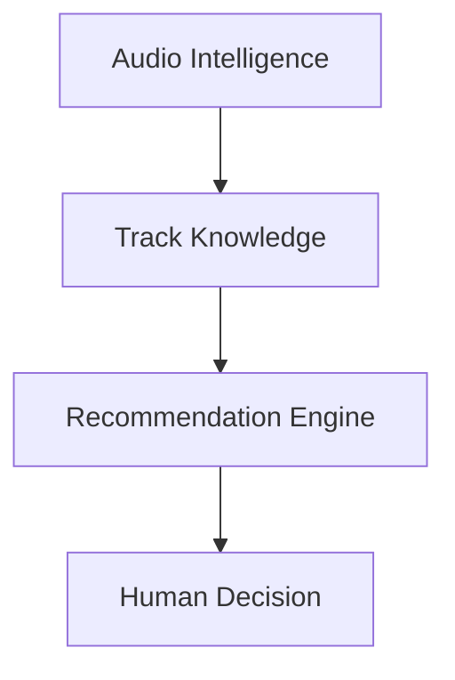

# AUDIO INTELLIGENCE — DJ COPILOT

## Overview

Audio Intelligence is the foundation layer of DJ Copilot.

The purpose of this subsystem is to transform raw audio signals into structured musical information that can be analyzed, compared, and used by higher-level intelligence systems.

Instead of treating a song as a simple audio file, DJ Copilot creates a multi-dimensional representation containing musical characteristics that describe how a track behaves.

The objective is to move from:

```
Audio File

↓

Musical Understanding
```

---

# Why Audio Intelligence Matters

Traditional music software usually focuses on basic metadata:

- BPM
- Key
- Duration
- Artist
- Genre

While these attributes are useful, they do not fully describe how a track functions inside a DJ performance.

Two tracks can have:

- Similar BPM
- Compatible keys

and still create a poor transition.

A successful mix depends on many additional factors:

- Energy evolution
- Rhythm behavior
- Frequency interaction
- Arrangement structure
- Vocal presence
- Musical texture

Audio Intelligence attempts to capture these relationships.

---

# Audio Understanding Pipeline

DJ Copilot follows a multi-stage analysis pipeline.


Each stage transforms the original audio into a richer representation.

---

# Audio Processing Layer

The first stage converts audio files into analyzable signals.

Responsibilities:

- File decoding
- Sample processing
- Channel handling
- Signal normalization
- Audio format compatibility

Supported formats depend on the decoding layer and available system codecs.

---

# Musical Feature Extraction

The feature extraction stage identifies measurable properties from the audio signal.

Current feature categories include:

---

## Tempo Analysis

Tempo represents the rhythmic speed of a track.

Extracted information includes:

- BPM estimation
- Beat positions
- Tempo stability
- Rhythmic consistency

Tempo information helps evaluate whether two tracks can coexist naturally.

---

## Harmonic Analysis

Harmonic compatibility is essential for smooth transitions.

The system analyzes:

- Musical key
- Harmonic relationships
- Key compatibility
- Camelot representation

This allows recommendations to consider musical harmony instead of only timing.

---

## Spectral Analysis

Spectral analysis studies the distribution of frequencies inside the track.

The system evaluates:

- Frequency bands
- Spectral energy
- Timbre characteristics
- Frequency conflicts

This information is useful for identifying how different tracks may interact during mixing.

---

## Energy Analysis

Energy represents the intensity evolution of a track.

The system analyzes:

- Overall energy level
- Dynamic changes
- Peaks
- Drops
- Build-ups

Energy information allows recommendations to consider the emotional progression of a set.

---

## Groove and Rhythm Analysis

Rhythmic behavior strongly influences compatibility.

The system evaluates:

- Groove density
- Beat patterns
- Rhythmic complexity
- Percussion characteristics

This helps identify tracks with similar movement and feel.

---

## Vocal Analysis

Vocals introduce additional considerations during mixing.

The system can estimate:

- Vocal presence
- Vocal sections
- Potential overlap conflicts

This information can influence transition recommendations.

---

# Track Intelligence Profile

After analysis, every track is represented as a structured profile.

Conceptually:

```json
{
  "track": "example.wav",
  "tempo": {
    "bpm": 128
  },
  "harmony": {
    "key": "A minor"
  },
  "energy": {
    "level": 0.82
  },
  "spectral_profile": {},
  "rhythm_profile": {},
  "vocal_profile": {}
}
```

This profile becomes the foundation for recommendation and transition systems.

---

# Feature Representation

DJ Copilot converts extracted information into numerical representations.

These representations allow the system to compare tracks mathematically.

Example:

```
Track A

↓

Feature Vector

↓

Similarity Calculation

↓

Track Relationship
```

This enables large libraries to be searched efficiently.

---

# Music Similarity

Similarity is not defined by a single value.

DJ Copilot considers multiple dimensions.

Conceptually:

```
Similarity =

Harmony

+

Tempo

+

Timbre

+

Groove

+

Energy

```

Different contexts may require different weighting strategies.

A club transition may prioritize energy.

A smooth harmonic mix may prioritize key compatibility.

---

# Relationship With Recommendation Engine

Audio Intelligence does not decide which song should play next.

Its responsibility is understanding the available information.

The relationship is:



Audio Intelligence provides understanding.

The Recommendation Engine provides suggestions.

The DJ provides creativity.

---

# Future Development

Future improvements may include:

## Semantic Music Understanding

Moving beyond measurable audio properties into deeper musical concepts.

Potential areas:

- Mood recognition
- Emotional progression
- Musical themes
- Context understanding

---

## Advanced Embeddings

Improving track representations through:

- Deep learning models
- Better audio embeddings
- Larger-scale similarity systems

---

## Structural Understanding

Analyzing:

- Intro sections
- Breakdowns
- Drops
- Chorus
- Outro
- Arrangement patterns

---

## Cross-Domain Audio Analysis

Future systems could expand beyond DJ workflows into:

- Music production
- Media creation
- Sound design
- Performance analysis

---

# Design Principles

Audio Intelligence follows several principles:

## Extract Knowledge, Not Just Features

The goal is not collecting numbers.

The goal is creating useful musical understanding.

---

## Preserve Context

A feature has meaning only when interpreted within a musical situation.

---

## Support Creativity

Analysis exists to empower human decisions.

---

## Build Reusable Intelligence

The representation created here should support multiple future applications.

---

# Summary

Audio Intelligence transforms DJ Copilot from a simple recommendation system into a platform capable of understanding relationships between musical pieces.

By converting audio signals into structured musical knowledge, the system creates the foundation for intelligent recommendations, transition assistance, and future music intelligence capabilities.
