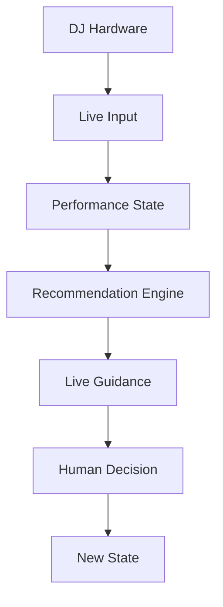
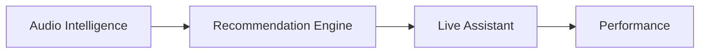

# LIVE ASSISTANT — DJ COPILOT

## Overview

The Live Assistant is the real-time intelligence layer of DJ Copilot.

Its purpose is to provide contextual assistance during live performances by continuously analyzing performance state and delivering recommendations with minimal latency.

Unlike offline recommendation systems, the Live Assistant operates under real-time constraints.

The objective is:

```
Understand the current performance

↓

Generate useful guidance

↓

Support the DJ in real time
```

---

# Purpose

The Live Assistant helps DJs during active sessions by providing:

- Real-time track recommendations
- Transition suggestions
- Performance awareness
- Mixing guidance
- Controller integration
- Live state synchronization

The system acts as a digital performance assistant.

---

# Real-Time Architecture

The Live Assistant follows a continuous feedback loop.



The system continuously adapts to the current situation.

---

# Live State Management

The system maintains a representation of the current performance.

Possible state information includes:

- Current playing track
- Playback position
- BPM
- Key
- Energy level
- Controller state
- Crossfader position
- User actions

Example:

```json
{
  "track": "current_song.wav",
  "position": "03:21",
  "bpm": 128,
  "energy": 0.78,
  "transition_state": "building"
}
```

---

# Hardware Integration

The Live Assistant communicates with external DJ equipment.

Supported concepts:

- MIDI controllers
- DJ software state
- Hardware events
- Real-time controls

The architecture separates hardware communication from intelligence logic.

```
Hardware

↓

Interface Layer

↓

Live State

↓

Intelligence System
```

This allows future compatibility with different platforms.

---

# Real-Time Recommendation

Recommendations during a live set require additional context.

The system considers:

- Current track position
- Remaining song structure
- Energy direction
- Available compatible tracks
- Current performance objective

A recommendation during a live performance is different from a recommendation during library browsing.

---

# Transition Guidance

The Live Assistant can provide guidance such as:

```
Suggested action:

Prepare next track

↓

Start transition around:

02:45

↓

Reduce bass gradually

↓

Introduce vocals after breakdown
```

The objective is not automatic mixing.

The objective is helping the DJ execute creative decisions.

---

# Low Latency Design

Live environments require immediate feedback.

The system prioritizes:

- Fast state updates
- Efficient processing
- Local computation
- Lightweight communication
- Cached analysis

Expensive operations should happen before performance whenever possible.

---

# WebSocket Communication

Real-time updates are managed through asynchronous communication.

Conceptually:

```
DJ State

↓

WebSocket Channel

↓

Frontend Interface

↓

Live Recommendations
```

This allows the interface to update without requiring constant manual refresh.

---

# User Interface Responsibilities

The Live Assistant interface should prioritize:

- Quick understanding
- Minimal distraction
- Clear recommendations
- Important information only

During performance, information overload is harmful.

The interface should assist without interrupting workflow.

---

# Safety and Control

The DJ remains the final authority.

The Live Assistant should never:

- Force actions
- Automatically change performance decisions
- Remove creative control

The system provides suggestions.

The human performs.

---

# Future Evolution

Future improvements may include:

## Advanced Performance Understanding

Analyzing:

- Set progression
- Audience response
- Venue context
- Performance goals

---

## Predictive Assistance

Predicting upcoming needs:

- Energy adjustments
- Transition preparation
- Track preparation

---

## Deeper Integration

Potential integrations:

- Professional DJ software
- Hardware ecosystems
- Cloud libraries
- Collaborative workflows

---

# Relationship With Other Modules

The Live Assistant depends on multiple internal systems.



Each layer contributes:

Audio Intelligence:

> Understands music.

Recommendation Engine:

> Evaluates possibilities.

Live Assistant:

> Delivers assistance at the right moment.

---

# Summary

The Live Assistant transforms DJ Copilot from a preparation tool into a real-time performance companion.

By combining live state awareness, music intelligence, and low-latency communication, the system supports DJs during the moments where timing, intuition, and creativity matter most.

The objective is not automation.

The objective is augmentation.
