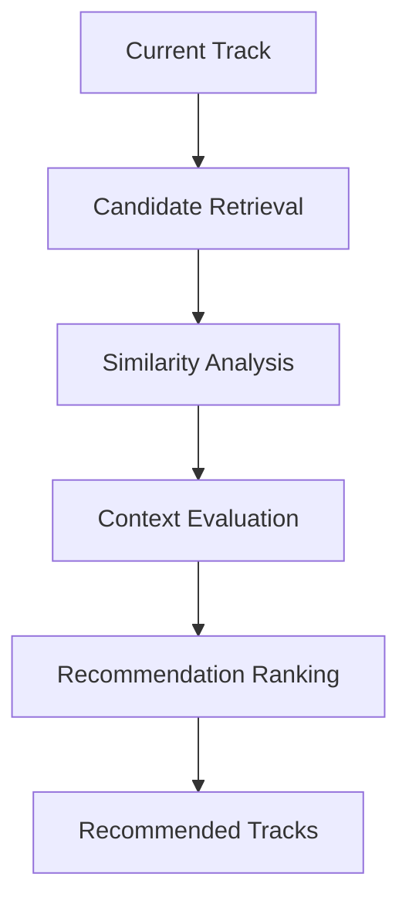

# RECOMMENDATION ENGINE — DJ COPILOT

## Overview

The Recommendation Engine is the intelligence layer responsible for discovering relationships between tracks and generating meaningful musical suggestions.

Unlike traditional recommendation systems based only on metadata or similarity matching, DJ Copilot evaluates multiple musical dimensions simultaneously.

The objective is not simply:

```
Find similar songs
```

The objective is:

```
Understand the current musical context

↓

Evaluate possible next actions

↓

Recommend the most suitable transition
```

---

# Purpose

The Recommendation Engine transforms analyzed track information into actionable suggestions for DJs.

Its responsibilities include:

- Finding compatible tracks
- Ranking possible next choices
- Evaluating transition quality
- Considering musical direction
- Adapting recommendations based on user preferences

The engine acts as a decision-support system.

It does not replace the DJ's creativity.

---

# Recommendation Architecture

The recommendation pipeline follows multiple stages.



Each stage progressively reduces uncertainty until the system produces useful suggestions.

---

# Candidate Retrieval

The first stage identifies possible tracks that could follow the current selection.

Sources may include:

- Imported music libraries
- Previously analyzed tracks
- User collections
- Similarity indexes

The goal is not selecting immediately.

The goal is creating a meaningful candidate space.

---

# Musical Compatibility Analysis

Each candidate is evaluated through multiple dimensions.

---

# Harmonic Compatibility

Harmony is one of the most important factors in smooth transitions.

The system evaluates:

- Musical key
- Camelot compatibility
- Harmonic distance
- Potential dissonance

Example:

```
Track A

Key: 8A

↓

Track B

Key: 8A / 9A / 7A

↓

High harmonic compatibility
```

---

# Tempo Compatibility

Tempo analysis evaluates rhythmic compatibility.

Considerations include:

- BPM difference
- Tempo stability
- Natural speed adjustment range

The objective is identifying transitions that feel musically natural.

---

# Timbre Similarity

Two tracks may share similar energy but have completely different textures.

Timbre analysis considers:

- Instrumentation
- Frequency distribution
- Sound characteristics

This helps avoid transitions that technically work but feel disconnected.

---

# Groove Compatibility

Rhythm is not only BPM.

The engine also considers:

- Percussion style
- Groove density
- Rhythmic patterns

This improves recommendations between tracks with similar movement.

---

# Energy Compatibility

Energy determines the direction of a musical journey.

The engine evaluates:

- Current energy level
- Future energy level
- Build-up potential
- Reduction possibilities

Examples:

```
Warm-up

↓

Progressive increase

↓

Peak moment

↓

Controlled release
```

A good recommendation depends on the intended direction.

---

# Affinity Scoring System

DJ Copilot combines multiple signals into a unified compatibility score.

Conceptually:

```
Affinity Score =

Harmony Weight

+

Tempo Weight

+

Timbre Weight

+

Groove Weight

+

Energy Weight
```

The weights can evolve depending on context.

For example:

Club performance:

```
Energy > Harmony
```

Technical mixing:

```
Harmony > Energy
```

The system is designed to support different creative approaches.

---

# Similarity Search

To efficiently search large libraries, DJ Copilot uses vector-based similarity.

The process:


This allows the system to search thousands of tracks efficiently.

---

# Ranking System

After candidate generation, tracks are ranked according to multiple factors.

Ranking considers:

- Musical compatibility
- Context relevance
- User preferences
- Previous feedback
- Confidence score

The result is a prioritized recommendation list.

---

# Context Awareness

A recommendation is only meaningful when context is considered.

Possible contextual inputs:

- Current track
- Current set direction
- Performance situation
- User preference
- Audience energy
- Previous decisions

The same song can be a great recommendation in one moment and a poor recommendation in another.

---

# User Personalization

Every DJ has a different style.

The Recommendation Engine supports adaptation through:

- User feedback
- Preferred artists
- Preferred genres
- Historical decisions
- Manual corrections

The objective is building a recommendation style unique to each user.

---

# Human Feedback Loop

The system improves through interaction.

```mermaid
flowchart TD

Recommendation

-->

DJ Evaluation

-->

Feedback

-->

Learning System

-->

Improved Ranking
```

Positive and negative feedback become signals for future improvements.

---

# Explainable Recommendations

Every recommendation should have a reason.

Example:

```
Recommended Track:

Artist - Song

Reasons:

✓ Compatible key
✓ Similar energy progression
✓ Smooth BPM transition
✓ Matching groove characteristics

Confidence: 91%
```

Explainability builds trust between the DJ and the system.

---

# Failure Handling

The engine should handle situations where no perfect transition exists.

Possible strategies:

- Relax similarity requirements
- Suggest alternative paths
- Provide lower-confidence options
- Explain limitations

A useful assistant should communicate uncertainty.

---

# Future Evolution

Future versions may include:

## Advanced Context Models

Understanding:

- Set progression
- Audience response
- Venue type
- Performance goals

---

## Deep Learning Recommendations

Potential improvements:

- Neural music embeddings
- Large-scale similarity models
- Learned transition patterns

---

## Semantic Music Understanding

Future systems may understand:

- Mood
- Emotion
- Atmosphere
- Musical intention

---

## Multi-Application Support

The recommendation engine architecture can support future products beyond DJ workflows.

Potential domains:

- Music production
- Creative workflows
- Media composition
- Entertainment systems

---

# Design Principles

## Quality Over Quantity

A few meaningful recommendations are better than many irrelevant options.

---

## Context Over Similarity

The closest track is not always the best track.

---

## Assistance Over Automation

The system recommends.

The human decides.

---

## Continuous Improvement

Every interaction can improve future performance.

---

# Summary

The Recommendation Engine is the central decision-support component of DJ Copilot.

By combining audio intelligence, similarity search, musical context, and adaptive learning, the system transforms raw track analysis into practical creative assistance.

Its purpose is not replacing the DJ.

Its purpose is helping DJs make better musical decisions faster.
